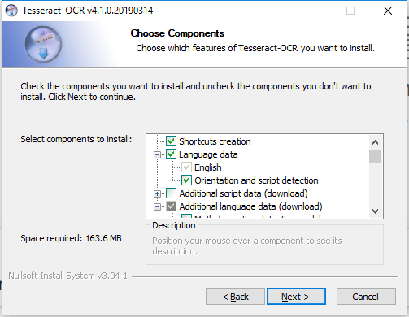
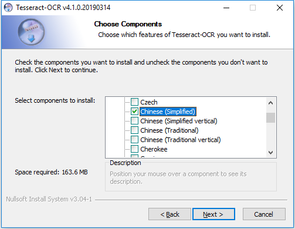

# Use Vcpkg to build third application.

Before doing this, download git cmake, and add them to Environment PATH

Open PowerShell, 

```
PS> git clone https://github.com/Microsoft/vcpkg.git
PS> cd vcpkg
PS> .\bootstrap-vcpkg.bat
```

Add the vcpkg path to Environment PATH.

Reopen PowerShell with administrator,

```
PS> vcpkg integrate install
```

Then, at any time, you can download the packages managed by vcpkg.  
**For example:**

```
PS> vcpkg install curl # install specific package
```

You can use vcpkg to search packages:
```
PS> vcpkg search # View all packages
PS> vcpkg search tesseract # Search specific packages
```

# install tesseract

### two ways

### method 1: use vcpkg to build tesseract

```
vcpkg install tesseract
```

### method 2: download pre-built binary package to install directly

* [tesseract-ocr-w32-setup-v4.1.0.20190314 (rc1)](https://digi.bib.uni-mannheim.de/tesseract/tesseract-ocr-w32-setup-v4.1.0.20190314.exe) (32 bit) and
* [tesseract-ocr-w64-setup-v4.1.0.20190314 (rc1)](https://digi.bib.uni-mannheim.de/tesseract/tesseract-ocr-w64-setup-v4.1.0.20190314.exe) (64 bit) resp.

when installing the package, choose "Additional language data(language)" --> "Chinaese (Simplified)", the other is default.




After install, you can test:

```
PS> .\tesseract.exe INPUT_IMAGES\chi_sim\timg.jpg OUTPUT_IMAGES\chi_sim -l chi_sim
```

